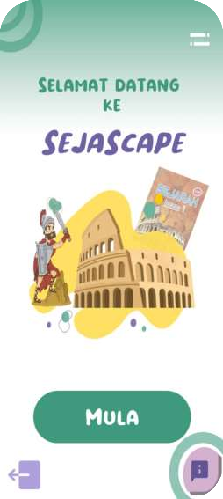
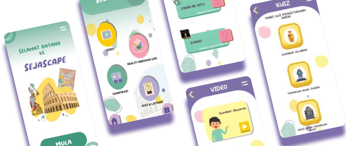
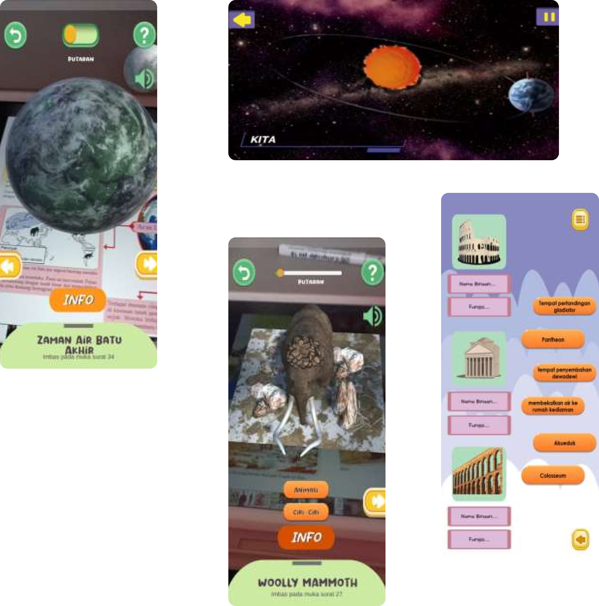

# SejaScape
# Project Title: Interactive Augmented Reality Learning App for "Sejarah Tingkatan 1"

# Project Description:
Our project is an innovative and interactive mobile application designed to enhance the learning experience for Form 1 students studying "Sejarah Tingkatan 1" (History at Form 1 level). This educational app leverages Augmented Reality (AR) technology to make history lessons engaging and immersive.

# Main Objectives:

Augmented Reality 3D Models: The app incorporates AR technology, allowing students to bring history to life. By simply pointing their mobile devices at textbook images (markers), students can view 3D models related to historical events, artifacts, and figures. This immersive experience helps students visualize and better understand the subject matter.

Interactive Quizzes: To reinforce learning, the app includes interactive quizzes covering various history topics. Students can test their knowledge and receive immediate feedback, making learning fun and interactive.

Mini Games: Learning is further gamified through mini-games related to historical events. These games challenge students to apply their knowledge in a playful and engaging manner.

Video Explanations: For in-depth comprehension, the app provides access to explanatory videos. These videos break down complex historical topics into easy-to-understand visual explanations, ensuring students grasp key concepts.

# Benefits:

Engagement: The AR elements and interactive quizzes make history lessons engaging and exciting for students.
Visual Learning: 3D models and videos enhance visual learning, aiding in better retention of historical facts.
Self-Assessment: Quizzes and games empower students to assess their understanding independently.
Accessibility: The app serves as a supplementary learning tool that students can access anytime, anywhere.
Educational Impact:
This AR-based learning app for "Sejarah Tingkatan 1" not only simplifies historical concepts but also fosters a deeper appreciation for Malaysia's rich history. By making learning interactive and enjoyable, it aims to improve students' performance in the subject while nurturing a genuine interest in history.

In summary, our project is at the forefront of leveraging technology to transform history education. It offers an immersive learning experience that goes beyond traditional textbooks, making history come alive for Form 1 students.

Below are some of the final product results:

